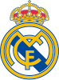
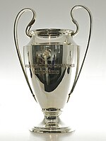
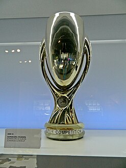

<!DOCTYPE html>
<html lang="en">
<head>
    <title>REAL MADRID</title>
    <link rel="stylesheet" href="styles.css">
</head>
<body>
    <header>
        <h1>Welcome to REAL MADRED FC Online Museum</h1>
        
            <ul>
                <li><a href="#OVERVIEW">Over View</a></li>
                <li><a href="#about">About Us</a></li>
                <li><a href="#contact">Contact</a></li>
            </ul>
        
    </header>
    <main>
        <section id="OVERVIEW">
            <h2>Over View</h2>
            <article>
<h3>Logo</h3>

The first crest had a simple design consisting of a decorative interlacing of the three initials of the club, "MCF" for Madrid Club de Fútbol, in dark blue on a white shirt. The first change in the crest occurred in 1908 when the letters adopted a more streamlined form and appeared inside a circle.[182] The next change in the configuration of the crest did not occur until the presidency of Pedro Parages in 1920. At that time, King Alfonso XIII granted the club his royal patronage which came in the form of the title "Real Madrid," meaning "Royal."[183] Thus, Alfonso's crown was added to the crest and the club styled itself Real Madrid Club de Fútbol.

With the dissolution of the monarchy in 1931, all royal symbols (the crown on the crest and the title of Real) were eliminated. The crown was replaced by the dark mulberry band of the Region of Castile.[48] In 1941, two years after Nationalist victory in the Civil War, the Francoist regime restored the crest's "Real Corona", or "Royal Crown", while the mulberry stripe of Castile was retained as well.[184][56] In addition, the whole crest was made full color, with gold being the most prominent, and the club went back to its honorific name Real Madrid Club de Fútbol.[182] The most recent modification to the crest occurred in 2001 when the club wanted to better situate itself for the 21st century and further standardize its crest. One of the modifications made was changing the mulberry stripe to a more bluish shade.

                <h3>The Tournaments</h3>
                
Explore our collection of Our World & Local Championships.

     <pre>  	          
 

</pre>

The UEFA Champions League (abbreviated as UCL) is an annual club association football competition organised by the Union of European Football Associations (UEFA) that is contested by top-division European clubs. The competition begins with a round robin league phase to qualify for the double-legged knockout rounds, and a single-leg final. It is the most-watched club competition in the world and the third most-watched football competition overall, behind only the UEFA European Championship and the FIFA World Cup. It is one of the most prestigious football tournaments in the world and the most prestigious club competition in European football, played by the national league champions (and, for some nations, one or more runners-up) of their national associations.
> 
<pre>
 

</pre>
 
The UEFA Super Cup is an annual super cup football match organised by UEFA and contested by the winners of the two main European club competitions: the UEFA Champions League and UEFA Europa League. The competition's official name was originally the Super Competition,[1] and later the European Super Cup. It was renamed the UEFA Super Cup in 1995, following a policy of rebranding by UEFA.
> 
            </article> 
<pre>
         

</pre>     
       <article>
                <h3>REAL MADRID FC STADIUM </h3>
                
Santiago Bernabéu Stadium (Spanish: Estadio Santiago Bernabéu, [esˈtaðjo sanˈtjaɣo βeɾnaˈβew] ) is a retractable roof football stadium in Madrid, Spain. With a seating capacity of 78,297,[2] the stadium has the second-largest seating capacity for a football stadium in Spain. It has been the home stadium of Real Madrid since its completion in 1947.

Named after footballer and legendary Real Madrid president Santiago Bernabéu (1895–1978), the stadium is one of the world's most famous football venues. It has hosted the final of the European Cup/UEFA Champions League on four occasions: in 1957, 1969, 1980, 2010.[6] The stadium also hosted the second leg of the 2018 Copa Libertadores Finals, making Santiago Bernabéu the first (and only) stadium to host the two most important premier continental cup finals (UEFA Champions League and Copa Libertadores).

                
            </article>
        </section>
        <section id="about">
            <h2>About Us</h2>
            
Our museum is dedicated To present the greatness of the century club of championships, history and others.

        </section>
        <section id="contact">
            <h2>Contact Us</h2>
            
If you have any questions, feel free to reach out!

            
<a href="mailto:realmadrid@onlinemuseum.com">Contact US</a>

        </section>
    </main>
    <footer>
        
&copy; 2024 Online Museum

    </footer>
</body>
</html>
